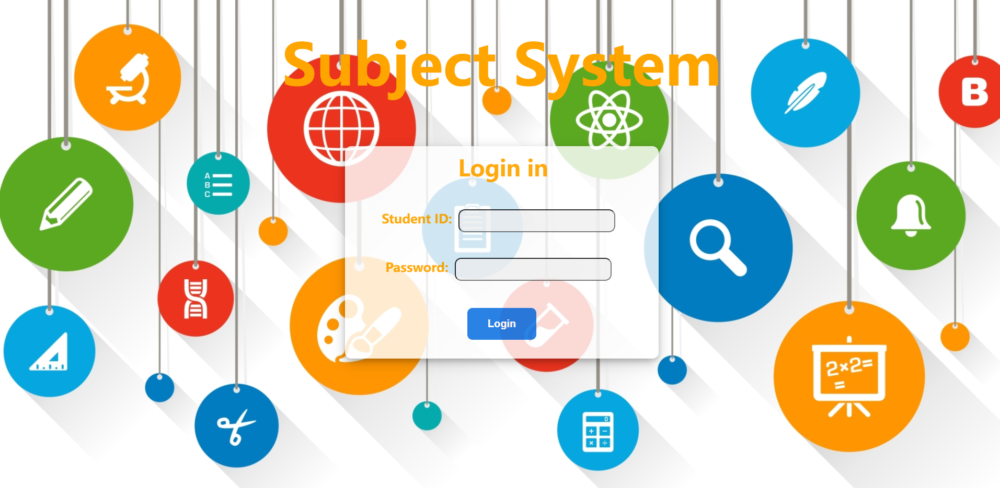
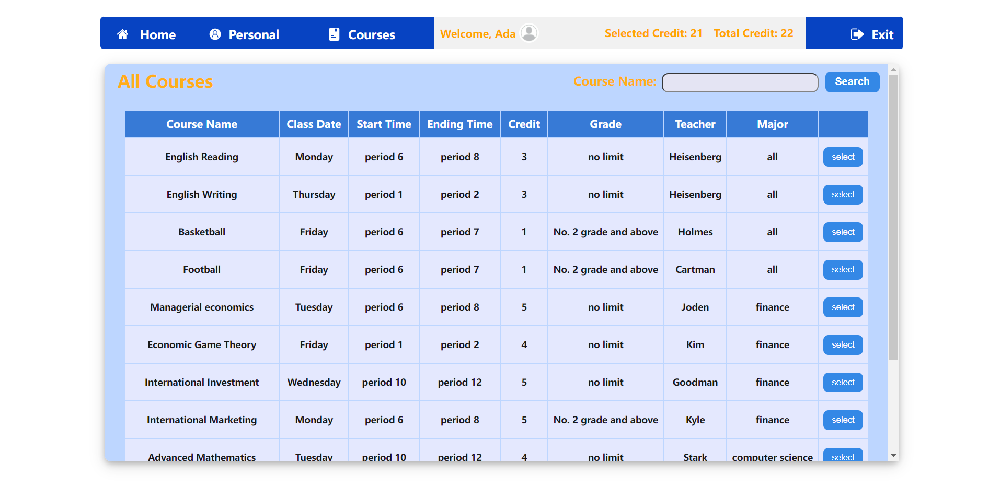
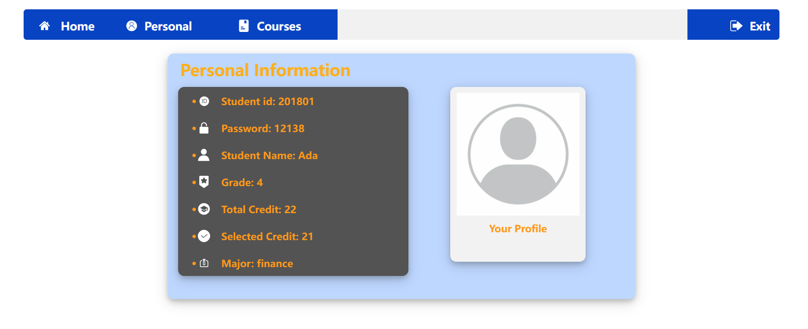

# Tiny Subject System
It is the tiny subject system mainly implemented by `SSM` for the course project of Database System and Internet Application Development. The project should be deployed on the Tomcat to execute. 

## Tiny Database
`studentcource.sql`  
The basic account information for login:  
|ID|Password|
|-|-|
|201801|12138|
|201901|233666|
|202001|010117|
|202101|aa1234|
## Environment
- IDEA 2021.1 ultimate
- JDK 1.8
- Tomcat 7.0.64
## JDBC properties
The properties of basic information for connecting the database lies in the file
```bash
code\ssm\src\main\resources\jdbc.properties
```
## Illustration
<div align=center>
    
    
    
</div>
